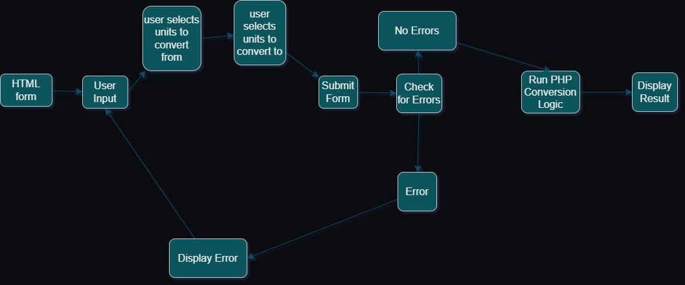
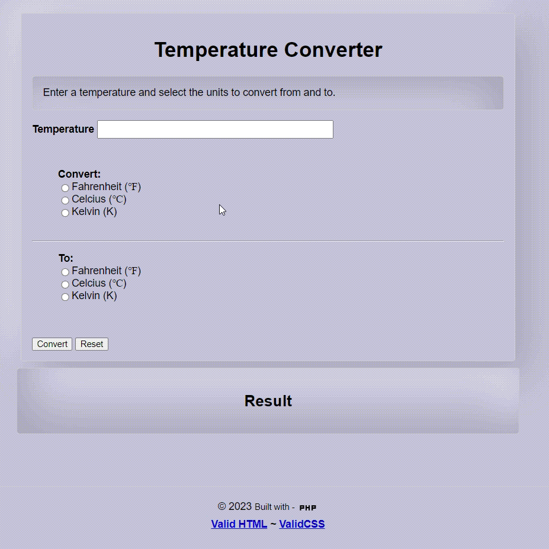

# IT262 - *Temperature Conversion*

Submitted by: *Mahlet Birhanu,
Matthieu Felker, Kota Sasaki*

This is a simple temperature conversion app that converts between Fahrenheit, Celsius and Kelvin.

We used PHP, HTML and CSS to build this app.

## Required Features

The following **required** functionality is completed:

* [x] Convert at least 3 temperature types, for example Fahrenheit to Celcius, Celcius to Fahrenheit and Fahrenheit to Kelvin.
* [x] Disallow incorrect data and provide feedback, for example, when a user inputs a string, the data is not processed and the user is informed of the mistake.
* [x] Be built as nearly as possible to [PSR-1](https://www.php-fig.org/psr/psr-1/) and [PSR-2](https://www.php-fig.org/psr/psr-2/) standards.

The following **optional** features are implemented:

* [x] Converts back and forth between all 3 types of temperatures, Fahrenheit, Celsius and Kelvin, back and forth (6 total conversions) and rounds the result to 2 decimal points.

## IPO / Flow Chart

Walkthrough of implemented features:

## Notes:

<b> Challenges encountered while building the app:</b>

 Undefined Array Key Warning when using the isset() function and submitting an empty form. We solved this by creating a new variable and assigning it to the value of the array key using $_POST. 

example:

 <code>
 if (isset($_POST['temp'])) {
    $temp = $_POST['temp'];
} else {
    $temp = '';
} 
 </code>

## License

    Copyright [1/8/2023] ["Mahlet Birhanu, Matthieu Felker, Kota Sasaki"]

    Licensed under the Apache License, Version 2.0 (the "License");
    you may not use this file except in compliance with the License.
    You may obtain a copy of the License at

        http://www.apache.org/licenses/LICENSE-2.0

    Unless required by applicable law or agreed to in writing, software
    distributed under the License is distributed on an "AS IS" BASIS,
    WITHOUT WARRANTIES OR CONDITIONS OF ANY KIND, either express or implied.
    See the License for the specific language governing permissions and
    limitations under the License.

